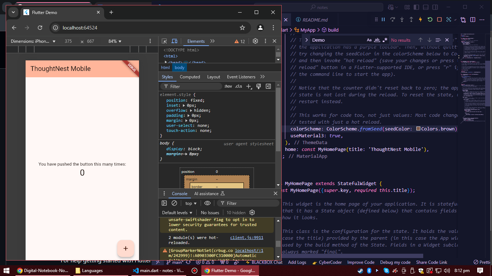
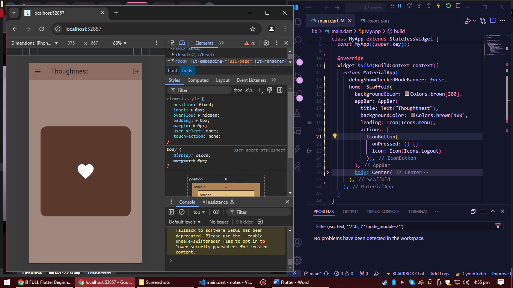
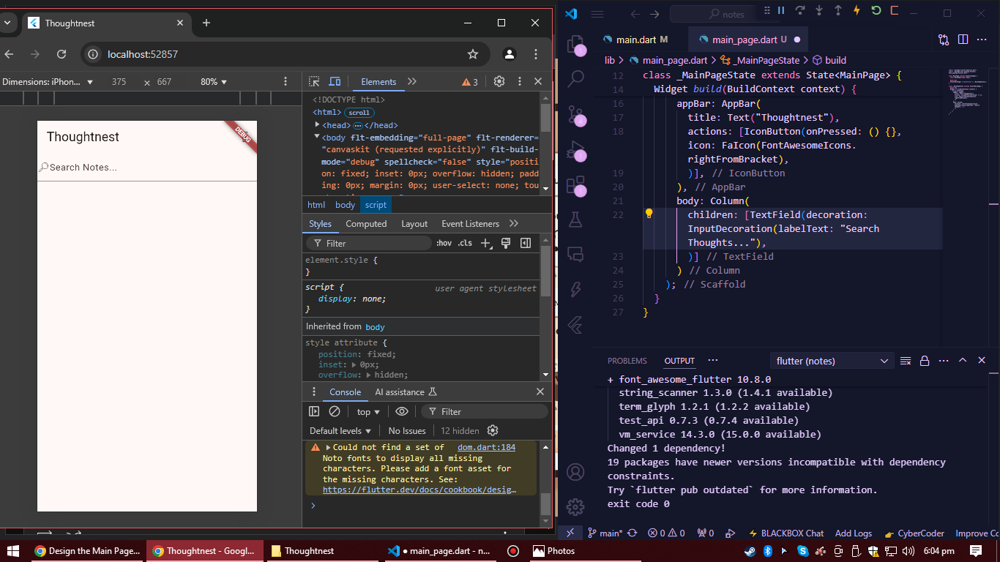
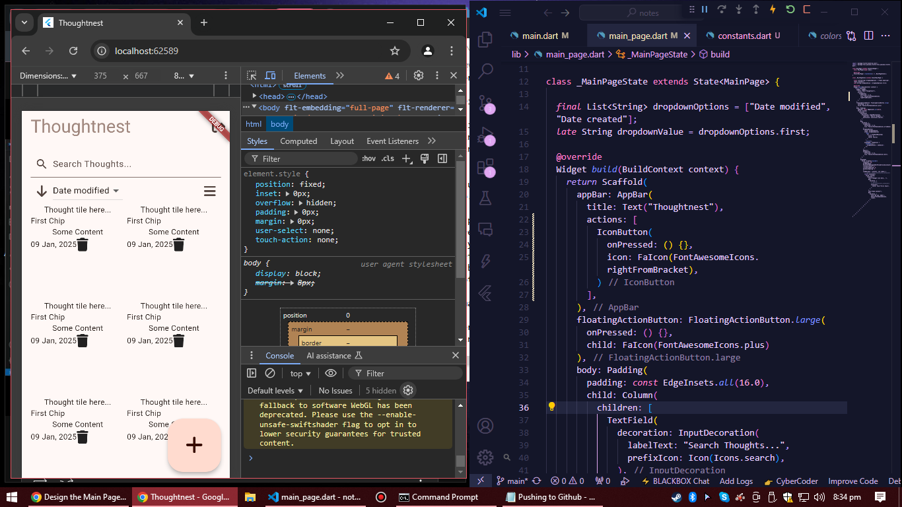

# 🌱 ThoughtNest (Notes App) Mobile version 🌱

* Dart & Flutter
* Firebase?
* VSCode

## ✨ Status: 
* Ongoing
* Slow Update

## 💬 Documentation (Started: February 1, 2025. Finished: ) 💬
* **Day 1:** Set up Flutter and VSCode on PC
   
* **Day 2:** Learned basic Flutter widgets. Added Notes' UI. Styled App Bar Menu
   
  
  

### YT Tutorials that I watched:
* [Sayed Mahmood Sayedi's Tutorial](https://www.youtube.com/watch?v=1GPpsfnNJzo&list=PLzzt2WMkurR2kE9TPm4BwW5XrvdavgZiV&index=3)
  
### 💬 Note:
I am also going to be using this application as an opportunity to learn Dart and Flutter in advance, since I KNOW that we will be making a project at the end of the school year using this language.
